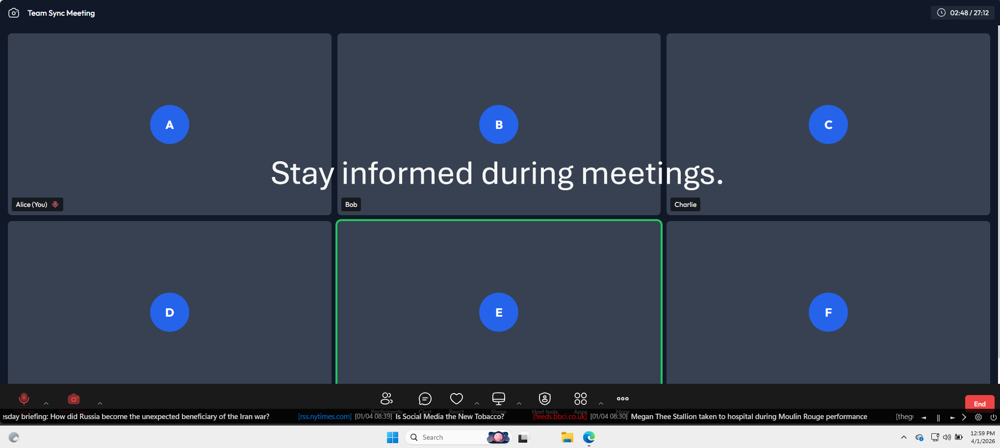
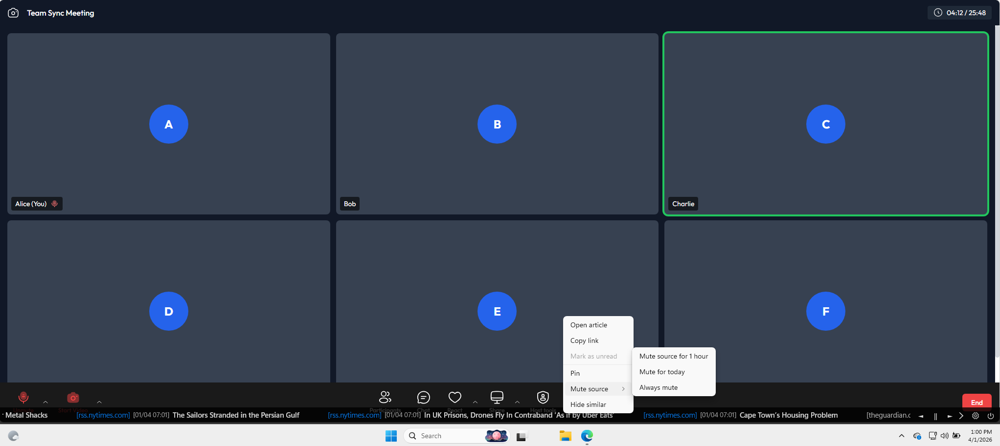
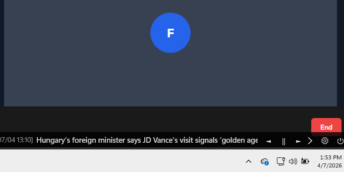
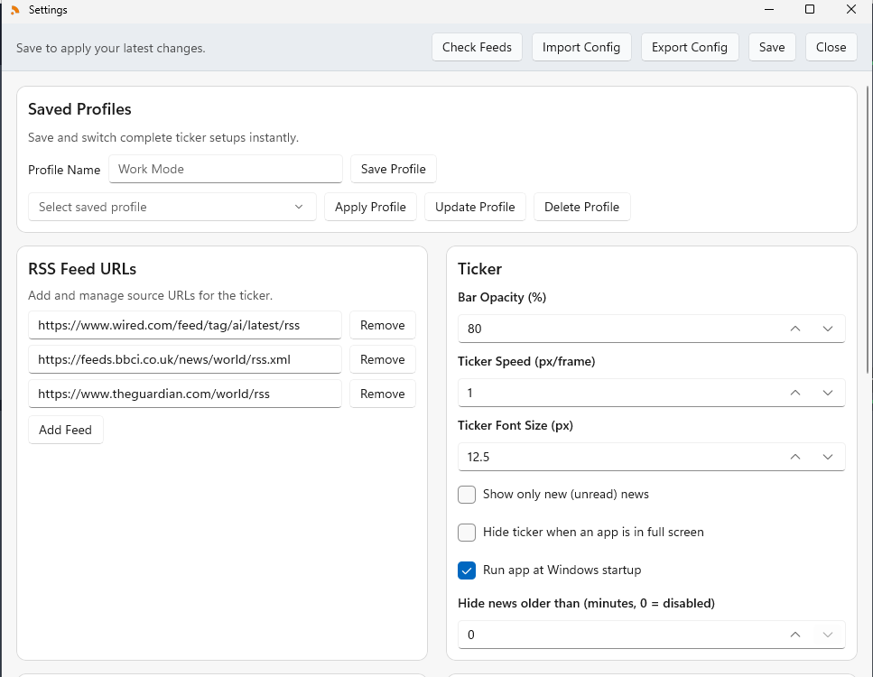
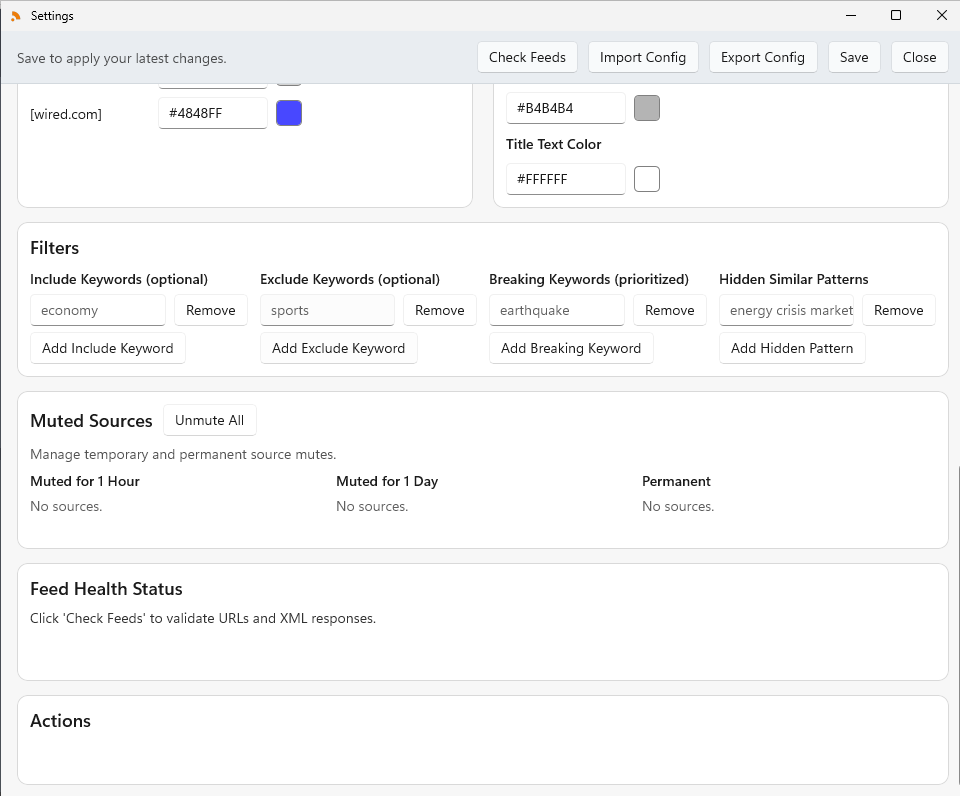
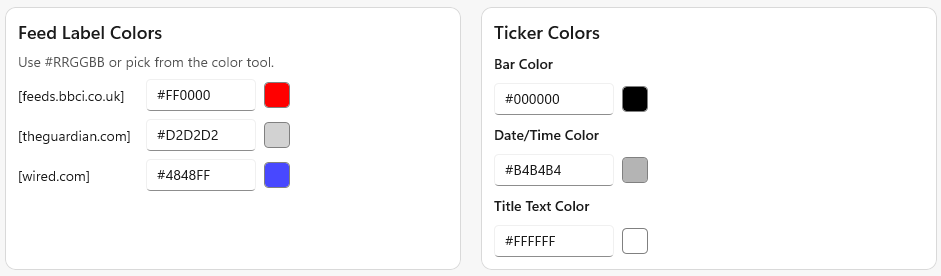

## 📄 Description

Live RSS news directly on your Windows taskbar — stay updated without interrupting your workflow.

Taskbar Ticker is a customizable desktop news ticker for Windows 10/11 that keeps live headlines visible above your taskbar.

### 🚀 Features

- Follow multiple RSS feeds in a single live ticker  
- Feed health monitoring to ensure reliable updates  
- Filter headlines with include/exclude keywords  
- Highlight breaking keywords with notifications  
- Pin and track read articles  
- Customize source colors for better visibility  
- Adjust ticker speed, font size, colors, and opacity  

### 💾 Storage

All settings are stored locally on your device.

## 📸 Screenshots

